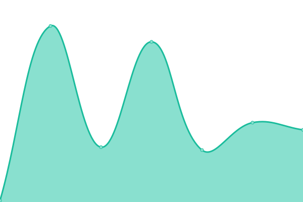
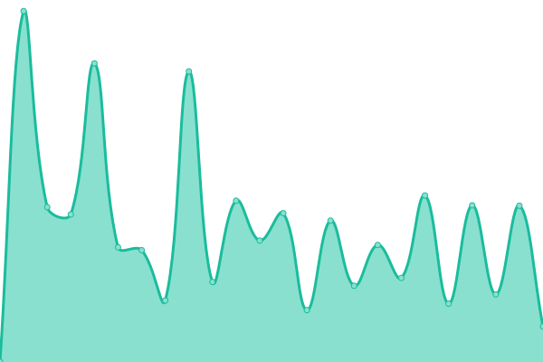
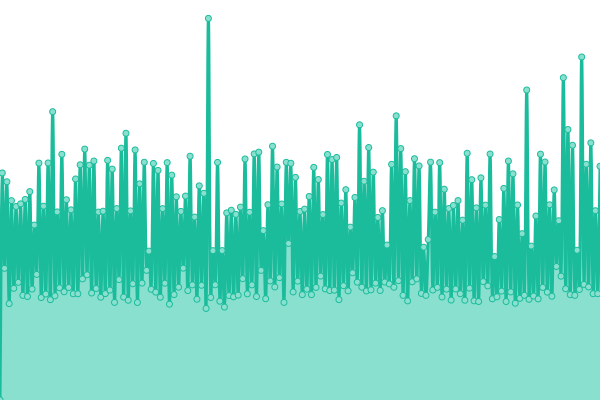
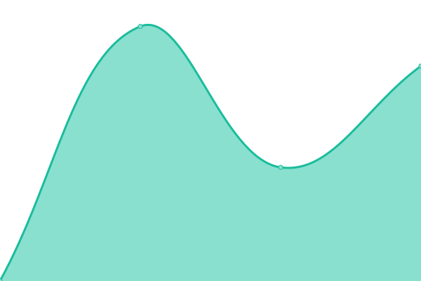

# [📈 Live Status](https://status-hao.chwang.com): <!--live status--> **🟧 Partial outage**

This repository contains the open-source uptime monitor and status page for [chwang-team](https://status-hao.chwang.com), powered by [Upptime](https://github.com/upptime/upptime).

With [Upptime](https://upptime.js.org), you can get your own unlimited and free uptime monitor and status page, powered entirely by a GitHub repository. We use [Issues](https://github.com/chwang-team/status-hao/issues) as incident reports, [Actions](https://github.com/chwang-team/status-hao/actions) as uptime monitors, and [Pages](https://status-hao.chwang.com) for the status page.

<!--start: status pages-->
<!-- This summary is generated by Upptime (https://github.com/upptime/upptime) -->
<!-- Do not edit this manually, your changes will be overwritten -->
<!-- prettier-ignore -->
| URL | Status | History | Response Time | Uptime |
| --- | ------ | ------- | ------------- | ------ |
|  [卖家精灵](https://www.sellersprite.com/) | 🟩 Up | [.yml](https://github.com/chwang-team/status-hao/commits/HEAD/history/.yml) | 

 4444ms
     
 | 

<a href="https://status-hao.chwang.com/history/">100.00%</a>
    

|  [鸥鹭选品](https://www.oalur.com/) | 🟩 Up | [.yml](https://github.com/chwang-team/status-hao/commits/HEAD/history/.yml) | 

 4444ms
     
 | 

<a href="https://status-hao.chwang.com/history/">100.00%</a>
    

|  [Jungle Scout](https://www.junglescout.com/) | 🟩 Up | [jungle-scout.yml](https://github.com/chwang-team/status-hao/commits/HEAD/history/jungle-scout.yml) | 

 2412ms
     
 | 

<a href="https://status-hao.chwang.com/history/jungle-scout">100.00%</a>
    

|  [AMZScout](https://amzscout.net/) | 🟩 Up | [amz-scout.yml](https://github.com/chwang-team/status-hao/commits/HEAD/history/amz-scout.yml) | 

 478ms
     
 | 

<a href="https://status-hao.chwang.com/history/amz-scout">100.00%</a>
    

|  [EasyYa易芽](https://app.easyya.com/) | 🟩 Up | [easy-ya.yml](https://github.com/chwang-team/status-hao/commits/HEAD/history/easy-ya.yml) | 

 1796ms
     
 | 

<a href="https://status-hao.chwang.com/history/easy-ya">100.00%</a>
    

|  [Helium 10](https://www.helium10.com/) | 🟩 Up | [helium-10.yml](https://github.com/chwang-team/status-hao/commits/HEAD/history/helium-10.yml) | 

 156ms
     
 | 

<a href="https://status-hao.chwang.com/history/helium-10">100.00%</a>
    

|  [Keepa](https://keepa.com/) | 🟩 Up | [keepa.yml](https://github.com/chwang-team/status-hao/commits/HEAD/history/keepa.yml) | 

 525ms
     
 | 

<a href="https://status-hao.chwang.com/history/keepa">100.00%</a>
    

|  [点金tool4seller](https://www.tool4seller.cn/) | 🟩 Up | [tool4seller.yml](https://github.com/chwang-team/status-hao/commits/HEAD/history/tool4seller.yml) | 

 2149ms
     
 | 

<a href="https://status-hao.chwang.com/history/tool4seller">100.00%</a>
    

|  [Sorftime](https://www.sorftime.com/) | 🟩 Up | [sorftime.yml](https://github.com/chwang-team/status-hao/commits/HEAD/history/sorftime.yml) | 

 13474ms
     
 | 

<a href="https://status-hao.chwang.com/history/sorftime">100.00%</a>
    

|  [AmzChart](https://amzchart.com/amazon-product-research) | 🟩 Up | [amz-chart.yml](https://github.com/chwang-team/status-hao/commits/HEAD/history/amz-chart.yml) | 

 564ms
     
 | 

<a href="https://status-hao.chwang.com/history/amz-chart">100.00%</a>
    

|  [MerchantWords ](https://www.merchantwords.com/) | 🟥 Down | [merchant-words.yml](https://github.com/chwang-team/status-hao/commits/HEAD/history/merchant-words.yml) | 

 82ms
     
 | 

<a href="https://status-hao.chwang.com/history/merchant-words">100.00%</a>
    

|  [Viral Launch](https://www.viral-launch.com/) | 🟩 Up | [viral-launch.yml](https://github.com/chwang-team/status-hao/commits/HEAD/history/viral-launch.yml) | 

 827ms
     
 | 

<a href="https://status-hao.chwang.com/history/viral-launch">100.00%</a>
    

|  [Fastmoss](https://www.fastmoss.com/) | 🟩 Up | [fastmoss.yml](https://github.com/chwang-team/status-hao/commits/HEAD/history/fastmoss.yml) | 

 378ms
     
 | 

<a href="https://status-hao.chwang.com/history/fastmoss">100.00%</a>
    

|  [滴答狗](https://didadog.com/) | 🟩 Up | [.yml](https://github.com/chwang-team/status-hao/commits/HEAD/history/.yml) | 

 4444ms
     
 | 

<a href="https://status-hao.chwang.com/history/">100.00%</a>
    

|  [Terapeak](https://www.ebay.com/sh/research) | 🟩 Up | [terapeak.yml](https://github.com/chwang-team/status-hao/commits/HEAD/history/terapeak.yml) | 

 710ms
     
 | 

<a href="https://status-hao.chwang.com/history/terapeak">100.00%</a>
    

|  [Shopeefans](https://www.shopeefans.com/) | 🟩 Up | [shopeefans.yml](https://github.com/chwang-team/status-hao/commits/HEAD/history/shopeefans.yml) | 

 1195ms
     
 | 

<a href="https://status-hao.chwang.com/history/shopeefans">100.00%</a>
    

|  [知虾](https://shopee.mobduos.com/) | 🟩 Up | [.yml](https://github.com/chwang-team/status-hao/commits/HEAD/history/.yml) | 

 4444ms
     
 | 

<a href="https://status-hao.chwang.com/history/">100.00%</a>
    

|  [Ali Insider](https://aliinsider.com/) | 🟩 Up | [ali-insider.yml](https://github.com/chwang-team/status-hao/commits/HEAD/history/ali-insider.yml) | 

 2720ms
     
 | 

<a href="https://status-hao.chwang.com/history/ali-insider">100.00%</a>
    

|  [米库](https://www.malllib.com/) | 🟩 Up | [.yml](https://github.com/chwang-team/status-hao/commits/HEAD/history/.yml) | 

 4444ms
     
 | 

<a href="https://status-hao.chwang.com/history/">100.00%</a>
    

|  [牛魔王](https://www.newmorehot.com/) | 🟩 Up | [.yml](https://github.com/chwang-team/status-hao/commits/HEAD/history/.yml) | 

 4444ms
     
 | 

<a href="https://status-hao.chwang.com/history/">100.00%</a>
    

|  [数字酋长](https://www.datacaciques.com/) | 🟩 Up | [.yml](https://github.com/chwang-team/status-hao/commits/HEAD/history/.yml) | 

 4444ms
     
 | 

<a href="https://status-hao.chwang.com/history/">100.00%</a>
    

|  [海鹰数据](https://haiyingshuju.com/) | 🟩 Up | [.yml](https://github.com/chwang-team/status-hao/commits/HEAD/history/.yml) | 

 4444ms
     
 | 

<a href="https://status-hao.chwang.com/history/">100.00%</a>
    

|  [Ali Inspector 2](https://aliinspector.com/) | 🟩 Up | [ali-inspector-2.yml](https://github.com/chwang-team/status-hao/commits/HEAD/history/ali-inspector-2.yml) | 

 643ms
     
 | 

<a href="https://status-hao.chwang.com/history/ali-inspector-2">100.00%</a>
    

|  [KeyWord Discovery](https://www.keyworddiscovery.com/) | 🟩 Up | [key-word-discovery.yml](https://github.com/chwang-team/status-hao/commits/HEAD/history/key-word-discovery.yml) | 

 397ms
     
 | 

<a href="https://status-hao.chwang.com/history/key-word-discovery">100.00%</a>
    

|  [AnswerThePublic](https://www.keyworddiscovery.com/) | 🟩 Up | [answer-the-public.yml](https://github.com/chwang-team/status-hao/commits/HEAD/history/answer-the-public.yml) | 

 228ms
     
 | 

<a href="https://status-hao.chwang.com/history/answer-the-public">100.00%</a>
    

|  [Crossker](https://crossker.com/) | 🟩 Up | [crossker.yml](https://github.com/chwang-team/status-hao/commits/HEAD/history/crossker.yml) | 

 1223ms
     
 | 

<a href="https://status-hao.chwang.com/history/crossker">100.00%</a>
    

|  [KeywordTool](https://keywordtool.io/) | 🟩 Up | [keyword-tool.yml](https://github.com/chwang-team/status-hao/commits/HEAD/history/keyword-tool.yml) | 

 385ms
     
 | 

<a href="https://status-hao.chwang.com/history/keyword-tool">100.00%</a>
    

|  [KeywordPlanner](https://adwords.google.cn/KeywordPlanner) | 🟩 Up | [keyword-planner.yml](https://github.com/chwang-team/status-hao/commits/HEAD/history/keyword-planner.yml) | 

 497ms
     
 | 

<a href="https://status-hao.chwang.com/history/keyword-planner">100.00%</a>
    

|  [MerchantWords](https://www.merchantwords.com/) | 🟥 Down | [merchant-words.yml](https://github.com/chwang-team/status-hao/commits/HEAD/history/merchant-words.yml) | 

 82ms
     
 | 

<a href="https://status-hao.chwang.com/history/merchant-words">100.00%</a>
    

|  [Wordtracker](https://www.wordtracker.com/) | 🟩 Up | [wordtracker.yml](https://github.com/chwang-team/status-hao/commits/HEAD/history/wordtracker.yml) | 

 247ms
     
 | 

<a href="https://status-hao.chwang.com/history/wordtracker">100.00%</a>
    

|  [西柚找词](https://www.xiyouzhaoci.com/) | 🟩 Up | [.yml](https://github.com/chwang-team/status-hao/commits/HEAD/history/.yml) | 

 4444ms
     
 | 

<a href="https://status-hao.chwang.com/history/">100.00%</a>
    

|  [鸥鹭关键词工具](https://www.oalur.com/landingpage/product-keyword/) | 🟩 Up | [.yml](https://github.com/chwang-team/status-hao/commits/HEAD/history/.yml) | 

 4444ms
     
 | 

<a href="https://status-hao.chwang.com/history/">100.00%</a>
    

|  [KWFinder](https://mangools.com/kwfinder/) | 🟩 Up | [kw-finder.yml](https://github.com/chwang-team/status-hao/commits/HEAD/history/kw-finder.yml) | 

 323ms
     
 | 

<a href="https://status-hao.chwang.com/history/kw-finder">100.00%</a>
    

|  [Audtools](https://www.audtools.com/) | 🟩 Up | [audtools.yml](https://github.com/chwang-team/status-hao/commits/HEAD/history/audtools.yml) | 

 860ms
     
 | 

<a href="https://status-hao.chwang.com/history/audtools">100.00%</a>
    

|  [1688](https://www.1688.com/) | 🟩 Up | [1688.yml](https://github.com/chwang-team/status-hao/commits/HEAD/history/1688.yml) | 

 1332ms
     
 | 

<a href="https://status-hao.chwang.com/history/1688">100.00%</a>
    

|  [义乌购](https://www.yiwugo.com/) | 🟩 Up | [.yml](https://github.com/chwang-team/status-hao/commits/HEAD/history/.yml) | 

 4444ms
     
 | 

<a href="https://status-hao.chwang.com/history/">100.00%</a>
    

|  [义务小商品城](https://www.chinagoods.com/) | 🟩 Up | [.yml](https://github.com/chwang-team/status-hao/commits/HEAD/history/.yml) | 

 4444ms
     
 | 

<a href="https://status-hao.chwang.com/history/">100.00%</a>
    

|  [网商园](https://wsy.com/) | 🟩 Up | [.yml](https://github.com/chwang-team/status-hao/commits/HEAD/history/.yml) | 

 4444ms
     
 | 

<a href="https://status-hao.chwang.com/history/">100.00%</a>
    

|  [17货源](https://www.17zwd.com/) | 🟩 Up | [17.yml](https://github.com/chwang-team/status-hao/commits/HEAD/history/17.yml) | 

 3266ms
     
 | 

<a href="https://status-hao.chwang.com/history/17">100.00%</a>
    

|  [四季星座网](https://www.571xz.com/) | 🟩 Up | [.yml](https://github.com/chwang-team/status-hao/commits/HEAD/history/.yml) | 

 4444ms
     
 | 

<a href="https://status-hao.chwang.com/history/">100.00%</a>
    

|  [青创网](https://www.17qcc.com/) | 🟩 Up | [.yml](https://github.com/chwang-team/status-hao/commits/HEAD/history/.yml) | 

 4444ms
     
 | 

<a href="https://status-hao.chwang.com/history/">100.00%</a>
    

|  [生意网](https://www.3e3e.cn/) | 🟩 Up | [.yml](https://github.com/chwang-team/status-hao/commits/HEAD/history/.yml) | 

 4444ms
     
 | 

<a href="https://status-hao.chwang.com/history/">100.00%</a>
    

|  [货捕头](https://www.hznzcn.com/) | 🟩 Up | [.yml](https://github.com/chwang-team/status-hao/commits/HEAD/history/.yml) | 

 4444ms
     
 | 

<a href="https://status-hao.chwang.com/history/">100.00%</a>
    

|  [衣联](https://www.eelly.com/) | 🟩 Up | [.yml](https://github.com/chwang-team/status-hao/commits/HEAD/history/.yml) | 

 4444ms
     
 | 

<a href="https://status-hao.chwang.com/history/">100.00%</a>
    

|  [搜款网](https://www.vvic.com/) | 🟩 Up | [.yml](https://github.com/chwang-team/status-hao/commits/HEAD/history/.yml) | 

 4444ms
     
 | 

<a href="https://status-hao.chwang.com/history/">100.00%</a>
    

|  [童商网](https://www.5ts.com/) | 🟩 Up | [.yml](https://github.com/chwang-team/status-hao/commits/HEAD/history/.yml) | 

 4444ms
     
 | 

<a href="https://status-hao.chwang.com/history/">100.00%</a>
    

|  [包牛牛](http://www.bao66.cn/) | 🟩 Up | [.yml](https://github.com/chwang-team/status-hao/commits/HEAD/history/.yml) | 

 4444ms
     
 | 

<a href="https://status-hao.chwang.com/history/">100.00%</a>
    

|  [台州开山网](https://www.k3.cn/) | 🟩 Up | [.yml](https://github.com/chwang-team/status-hao/commits/HEAD/history/.yml) | 

 4444ms
     
 | 

<a href="https://status-hao.chwang.com/history/">100.00%</a>
    

|  [美美淘](http://www.mmgg.com/) | 🟩 Up | [.yml](https://github.com/chwang-team/status-hao/commits/HEAD/history/.yml) | 

 4444ms
     
 | 

<a href="https://status-hao.chwang.com/history/">100.00%</a>
    

|  [鞋库网](https://www.cnxieku.com/index) | 🟩 Up | [.yml](https://github.com/chwang-team/status-hao/commits/HEAD/history/.yml) | 

 4444ms
     
 | 

<a href="https://status-hao.chwang.com/history/">100.00%</a>
    

|  [购途网](http://www.go2.cn/) | 🟩 Up | [.yml](https://github.com/chwang-team/status-hao/commits/HEAD/history/.yml) | 

 4444ms
     
 | 

<a href="https://status-hao.chwang.com/history/">100.00%</a>
    

|  [爱搜鞋](https://sooxie.com/) | 🟩 Up | [.yml](https://github.com/chwang-team/status-hao/commits/HEAD/history/.yml) | 

 4444ms
     
 | 

<a href="https://status-hao.chwang.com/history/">100.00%</a>
    

|  [娜拉美妆](https://www.nala.com.cn/) | 🟩 Up | [.yml](https://github.com/chwang-team/status-hao/commits/HEAD/history/.yml) | 

 4444ms
     
 | 

<a href="https://status-hao.chwang.com/history/">100.00%</a>
    

|  [个秀名妆](https://www.geshow.com/) | 🟩 Up | [.yml](https://github.com/chwang-team/status-hao/commits/HEAD/history/.yml) | 

 4444ms
     
 | 

<a href="https://status-hao.chwang.com/history/">100.00%</a>
    

|  [华强电子网](https://www.hqew.com/) | 🟩 Up | [.yml](https://github.com/chwang-team/status-hao/commits/HEAD/history/.yml) | 

 4444ms
     
 | 

<a href="https://status-hao.chwang.com/history/">100.00%</a>
    

|  [猎芯网](https://www.ichunt.com/) | 🟩 Up | [.yml](https://github.com/chwang-team/status-hao/commits/HEAD/history/.yml) | 

 4444ms
     
 | 

<a href="https://status-hao.chwang.com/history/">100.00%</a>
    

|  [华强商城](https://www.hqbuy.com/) | 🟩 Up | [.yml](https://github.com/chwang-team/status-hao/commits/HEAD/history/.yml) | 

 4444ms
     
 | 

<a href="https://status-hao.chwang.com/history/">100.00%</a>
    

|  [华秋商城](https://www.hqchip.com/) | 🟩 Up | [.yml](https://github.com/chwang-team/status-hao/commits/HEAD/history/.yml) | 

 4444ms
     
 | 

<a href="https://status-hao.chwang.com/history/">100.00%</a>
    

|  [世界工厂](https://www.gongchang.com/) | 🟩 Up | [.yml](https://github.com/chwang-team/status-hao/commits/HEAD/history/.yml) | 

 4444ms
     
 | 

<a href="https://status-hao.chwang.com/history/">100.00%</a>
    

|  [工邦邦](https://www.gongbangbang.com/) | 🟩 Up | [.yml](https://github.com/chwang-team/status-hao/commits/HEAD/history/.yml) | 

 4444ms
     
 | 

<a href="https://status-hao.chwang.com/history/">100.00%</a>
    

|  [中国制造网](https://cn.made-in-china.com/) | 🟩 Up | [.yml](https://github.com/chwang-team/status-hao/commits/HEAD/history/.yml) | 

 4444ms
     
 | 

<a href="https://status-hao.chwang.com/history/">100.00%</a>
    

|  [西域网](https://www.ehsy.com/) | 🟩 Up | [.yml](https://github.com/chwang-team/status-hao/commits/HEAD/history/.yml) | 

 4444ms
     
 | 

<a href="https://status-hao.chwang.com/history/">100.00%</a>
    

|  [慧聪网](https://www.hc360.com/) | 🟩 Up | [.yml](https://github.com/chwang-team/status-hao/commits/HEAD/history/.yml) | 

 4444ms
     
 | 

<a href="https://status-hao.chwang.com/history/">100.00%</a>
    

|  [中国供应商](https://cn.china.cn/) | 🟩 Up | [.yml](https://github.com/chwang-team/status-hao/commits/HEAD/history/.yml) | 

 4444ms
     
 | 

<a href="https://status-hao.chwang.com/history/">100.00%</a>
    

|  [搜了网](https://www.51sole.com/) | 🟩 Up | [.yml](https://github.com/chwang-team/status-hao/commits/HEAD/history/.yml) | 

 4444ms
     
 | 

<a href="https://status-hao.chwang.com/history/">100.00%</a>
    

|  [汽配人](http://www.qipeiren.com/) | 🟩 Up | [.yml](https://github.com/chwang-team/status-hao/commits/HEAD/history/.yml) | 

 4444ms
     
 | 

<a href="https://status-hao.chwang.com/history/">100.00%</a>
    

|  [工品优选](https://www.vipmro.com/) | 🟩 Up | [.yml](https://github.com/chwang-team/status-hao/commits/HEAD/history/.yml) | 

 4444ms
     
 | 

<a href="https://status-hao.chwang.com/history/">100.00%</a>
    

|  [91家纺](https://www.91jf.com/) | 🟩 Up | [91.yml](https://github.com/chwang-team/status-hao/commits/HEAD/history/91.yml) | 

 2004ms
     
 | 

<a href="https://status-hao.chwang.com/history/91">100.00%</a>
    

|  [找家纺网](https://www.zhaojiafang.com/) | 🟩 Up | [.yml](https://github.com/chwang-team/status-hao/commits/HEAD/history/.yml) | 

 4444ms
     
 | 

<a href="https://status-hao.chwang.com/history/">100.00%</a>
    

|  [家纺批发网](https://cp.tnc.com.cn/) | 🟩 Up | [.yml](https://github.com/chwang-team/status-hao/commits/HEAD/history/.yml) | 

 4444ms
     
 | 

<a href="https://status-hao.chwang.com/history/">100.00%</a>
    

|  [中外玩具网](https://www.ctoy.com.cn/sell/) | 🟩 Up | [.yml](https://github.com/chwang-team/status-hao/commits/HEAD/history/.yml) | 

 4444ms
     
 | 

<a href="https://status-hao.chwang.com/history/">100.00%</a>
    

|  [绒趣网](https://www.rongqu.net/) | 🟩 Up | [.yml](https://github.com/chwang-team/status-hao/commits/HEAD/history/.yml) | 

 4444ms
     
 | 

<a href="https://status-hao.chwang.com/history/">100.00%</a>
    

|  [玩具巴巴](https://www.toybaba.com/) | 🟩 Up | [.yml](https://github.com/chwang-team/status-hao/commits/HEAD/history/.yml) | 

 4444ms
     
 | 

<a href="https://status-hao.chwang.com/history/">100.00%</a>
    

|  [金文定制](https://www.giftres.com/) | 🟩 Up | [.yml](https://github.com/chwang-team/status-hao/commits/HEAD/history/.yml) | 

 4444ms
     
 | 

<a href="https://status-hao.chwang.com/history/">100.00%</a>
    

|  [办公车](https://www.officecar.cn/) | 🟩 Up | [.yml](https://github.com/chwang-team/status-hao/commits/HEAD/history/.yml) | 

 4444ms
     
 | 

<a href="https://status-hao.chwang.com/history/">100.00%</a>
    

|  [荣风华商城](https://www.szrfh.com/) | 🟩 Up | [.yml](https://github.com/chwang-team/status-hao/commits/HEAD/history/.yml) | 

 4444ms
     
 | 

<a href="https://status-hao.chwang.com/history/">100.00%</a>
    

|  [海创恒源](hhttps://www.hcbuy.com/) | 🟩 Up | [.yml](https://github.com/chwang-team/status-hao/commits/HEAD/history/.yml) | 

 4444ms
     
 | 

<a href="https://status-hao.chwang.com/history/">100.00%</a>
    

|  [文驹1号](https://www.wjyh.com/) | 🟥 Down | [1.yml](https://github.com/chwang-team/status-hao/commits/HEAD/history/1.yml) | 

 0ms
     
 | 

<a href="https://status-hao.chwang.com/history/1">100.00%</a>
    

|  [赛盈分销](https://www.saleyee.cn/) | 🟩 Up | [.yml](https://github.com/chwang-team/status-hao/commits/HEAD/history/.yml) | 

 4444ms
     
 | 

<a href="https://status-hao.chwang.com/history/">100.00%</a>
    

|  [VIOMALL跨境分销平台](https://www.viomall.com/) | 🟩 Up | [viomall.yml](https://github.com/chwang-team/status-hao/commits/HEAD/history/viomall.yml) | 

 1480ms
     
 | 

<a href="https://status-hao.chwang.com/history/viomall">100.00%</a>
    

|  [美适分销](https://www.mixsss.com/) | 🟩 Up | [.yml](https://github.com/chwang-team/status-hao/commits/HEAD/history/.yml) | 

 4444ms
     
 | 

<a href="https://status-hao.chwang.com/history/">100.00%</a>
    

|  [托尼斯](https://www.toonies.cn/) | 🟩 Up | [.yml](https://github.com/chwang-team/status-hao/commits/HEAD/history/.yml) | 

 4444ms
     
 | 

<a href="https://status-hao.chwang.com/history/">100.00%</a>
    

|  [CJdropshipping](https://www.cjdropshipping.com/) | 🟩 Up | [c-jdropshipping.yml](https://github.com/chwang-team/status-hao/commits/HEAD/history/c-jdropshipping.yml) | 

 557ms
     
 | 

<a href="https://status-hao.chwang.com/history/c-jdropshipping">100.00%</a>
    

|  [DOBA](https://www.doba.com/) | 🟥 Down | [doba.yml](https://github.com/chwang-team/status-hao/commits/HEAD/history/doba.yml) | 

 135ms
     
 | 

<a href="https://status-hao.chwang.com/history/doba">100.00%</a>
    

|  [出口易M2C供销平台](http://m2c.global360.com.cn/) | 🟩 Up | [m2-c.yml](https://github.com/chwang-team/status-hao/commits/HEAD/history/m2-c.yml) | 

 1549ms
     
 | 

<a href="https://status-hao.chwang.com/history/m2-c">100.00%</a>
    

|  [挚爱母婴](https://www.babyzhiai.net/) | 🟩 Up | [.yml](https://github.com/chwang-team/status-hao/commits/HEAD/history/.yml) | 

 4444ms
     
 | 

<a href="https://status-hao.chwang.com/history/">100.00%</a>
    

|  [越域网](https://www.kjds.com/) | 🟩 Up | [.yml](https://github.com/chwang-team/status-hao/commits/HEAD/history/.yml) | 

 4444ms
     
 | 

<a href="https://status-hao.chwang.com/history/">100.00%</a>
    

|  [Sunrise Wholesale](https://sunrisewholesalemerchandise.com/) | 🟩 Up | [sunrise-wholesale.yml](https://github.com/chwang-team/status-hao/commits/HEAD/history/sunrise-wholesale.yml) | 

 411ms
     
 | 

<a href="https://status-hao.chwang.com/history/sunrise-wholesale">100.00%</a>
    

|  [Oberlo](https:https://www.oberlo.com/) | 🟥 Down | [oberlo.yml](https://github.com/chwang-team/status-hao/commits/HEAD/history/oberlo.yml) | 

 0ms
     
 | 

<a href="https://status-hao.chwang.com/history/oberlo">100.00%</a>
    

|  [Wholesale 2B](https://www.wholesale2b.com/) | 🟩 Up | [wholesale-2-b.yml](https://github.com/chwang-team/status-hao/commits/HEAD/history/wholesale-2-b.yml) | 

 213ms
     
 | 

<a href="https://status-hao.chwang.com/history/wholesale-2-b">100.00%</a>
    

|  [SaleHoo](https://www.salehoo.com/) | 🟩 Up | [sale-hoo.yml](https://github.com/chwang-team/status-hao/commits/HEAD/history/sale-hoo.yml) | 

 211ms
     
 | 

<a href="https://status-hao.chwang.com/history/sale-hoo">100.00%</a>
    

|  [丝路云仓](https://www.cus-mall.com/) | 🟩 Up | [.yml](https://github.com/chwang-team/status-hao/commits/HEAD/history/.yml) | 

 4444ms
     
 | 

<a href="https://status-hao.chwang.com/history/">100.00%</a>
    

|  [海卖通](http://www.b2csupply.com/list/index/home) | 🟩 Up | [.yml](https://github.com/chwang-team/status-hao/commits/HEAD/history/.yml) | 

 4444ms
     
 | 

<a href="https://status-hao.chwang.com/history/">100.00%</a>
    

|  [Topdser](https://www.topdser.com/) | 🟩 Up | [topdser.yml](https://github.com/chwang-team/status-hao/commits/HEAD/history/topdser.yml) | 

 547ms
     
 | 

<a href="https://status-hao.chwang.com/history/topdser">100.00%</a>
    

|  [YMS.COM](https://www.yms.com/) | 🟩 Up | [yms-com.yml](https://github.com/chwang-team/status-hao/commits/HEAD/history/yms-com.yml) | 

 1285ms
     
 | 

<a href="https://status-hao.chwang.com/history/yms-com">100.00%</a>
    

|  [萌啦严选](http://hy.menglar.com/) | 🟩 Up | [.yml](https://github.com/chwang-team/status-hao/commits/HEAD/history/.yml) | 

 4444ms
     
 | 

<a href="https://status-hao.chwang.com/history/">100.00%</a>
    

|  [指纹定制](https://www.hicustom.com/) | 🟩 Up | [.yml](https://github.com/chwang-team/status-hao/commits/HEAD/history/.yml) | 

 4444ms
     
 | 

<a href="https://status-hao.chwang.com/history/">100.00%</a>
    

|  [飞飞鱼定制](https://www.viomall.com/) | 🟩 Up | [.yml](https://github.com/chwang-team/status-hao/commits/HEAD/history/.yml) | 

 4444ms
     
 | 

<a href="https://status-hao.chwang.com/history/">100.00%</a>
    

|  [SDS定制选品](https://www.sdsdiy.com/) | 🟩 Up | [sds.yml](https://github.com/chwang-team/status-hao/commits/HEAD/history/sds.yml) | 

 2562ms
     
 | 

<a href="https://status-hao.chwang.com/history/sds">100.00%</a>
    

|  [八点多定制](https://www.8ding.com/) | 🟩 Up | [.yml](https://github.com/chwang-team/status-hao/commits/HEAD/history/.yml) | 

 4444ms
     
 | 

<a href="https://status-hao.chwang.com/history/">100.00%</a>
    

|  [S2bdiy定制供应链](https://www.s2bdiy.com/) | 🟩 Up | [s2bdiy.yml](https://github.com/chwang-team/status-hao/commits/HEAD/history/s2bdiy.yml) | 

 964ms
     
 | 

<a href="https://status-hao.chwang.com/history/s2bdiy">100.00%</a>
    

|  [Printful](https://www.printful.com/) | 🟥 Down | [printful.yml](https://github.com/chwang-team/status-hao/commits/HEAD/history/printful.yml) | 

 103ms
     
 | 

<a href="https://status-hao.chwang.com/history/printful">100.00%</a>
    

<!--end: status pages-->

[**Visit our status website →**](https://status-hao.chwang.com)

## 📄 License

- Powered by: [Upptime](https://github.com/upptime/upptime)
- Code: [MIT](./LICENSE) © [Anand Chowdhary](https://anandchowdhary.com), supported by [Pabio](https://pabio.com)
- Data in the `./history` directory: [Open Database License](https://opendatacommons.org/licenses/odbl/1-0/)
